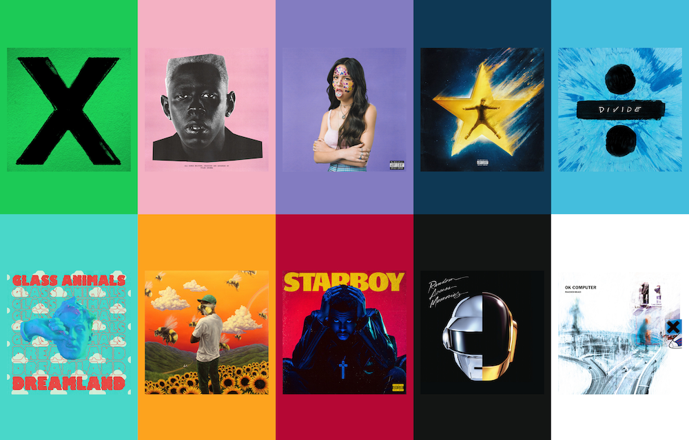

# UIImageColour

Colour fetching for `UIImage` to find the most dominant colour. This was inspired by jathu's [UIImageColors](https://github.com/jathu/UIImageColors).



## Example

```swift
let image = UIImage(named: "")

if let uiImageColour = image.analyzeImage() {
    let primaryColour = uiImageColour.dominantColor
} else {
    print("Failed to analyze the image.")
}
```

## Installation

#### Swift Package Manager
- File > Swift Packages > Add Package Dependency
- Add `https://github.com/ca13ra1/UIImageColour.git`

## License
[LICENSE](LICENSE)